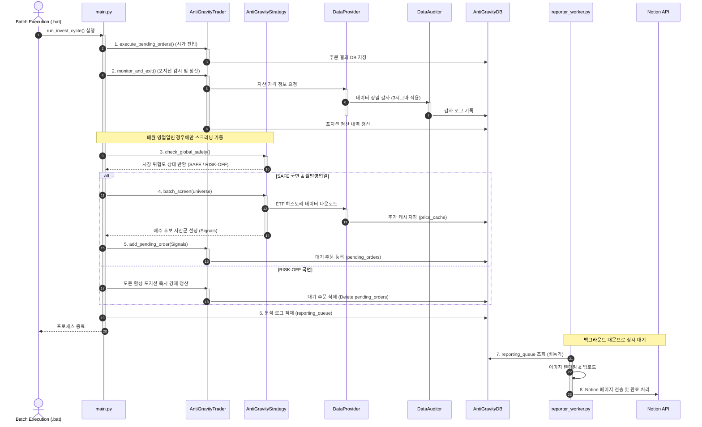
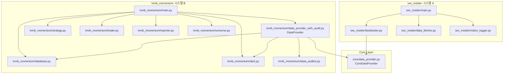

# 🗂️ Technical Architecture & PR Documentation: invest_provert

본 문서는 `invest_provert` 프로젝트의 전체 구조 설계 사상과 기술적 차별점을 버전 관리, 패키징, 백엔드 데이터베이스, 시스템 아키텍처 등 다각도에서 입체적으로 정리한 아키텍처 명세서입니다. 

이 문서는 프로젝트 포트폴리오 설명, 기술 리뷰, 혹은 시스템 유지보수를 위해 코드베이스의 핵심 구조와 작동 메커니즘을 설명하기 위해 작성되었습니다.

## 🎬 프로젝트 통합 작업 플로우 (Sequence Diagram)

본 프로젝트의 핵심 구동 도메인인 시스템 B(LV-MB & CTA 시뮬레이터)의 개별 컴포넌트 객체 간 세부 생명주기 및 메시지 흐름을 묘사한 시퀀스 다이어그램입니다.



---

## 1. 프로젝트 설계 사상 및 목적 (Design Philosophy & Purpose)

본 프로젝트는 성격이 다른 두 종류의 독립된 투자 자문/거래 시스템을 단일 코드베이스 내에서 효율적으로 관리하고 구동하기 위해 설계되었습니다. 두 시스템 간의 불필요한 결합을 차단하고, 순수 인프라 연산과 비즈니스 도메인을 명확히 계층화하여 아키텍처 건전성을 보장하는 데 목적이 있습니다.

핵심 설계 원칙은 다음과 같습니다:
* **독립적 도메인 격리**: 데일리 SEC 내부자 신호 추적 시스템(시스템 A)과 복합 모멘텀 투자 시뮬레이션(시스템 B)을 독립된 패키지 영역으로 구성하여 상호 간섭 차단.
* **관심사 분할 및 약결합(Loose Coupling)**: 데이터베이스 쓰기, 실시간 이상치 감사, 텔레그램/슬랙 알림 등의 도메인 종속 로직을 시스템 B에만 캡슐화하고, 시스템 A는 핵심 수학 연산 및 순수 다운로더(`core/`) 모듈만 사용하여 결합도 제거.
* **배포 환경 최적화**: GitHub Actions 가상머신(스케줄러) 환경과 로컬 데이터베이스 지속성(Persistence) 환경의 실행 컨텍스트 분리.

---

## 2. 시스템 아키텍처 및 패키지 구조 (System Architecture)

전체 프로젝트는 **의존성 역전 원칙(DIP)**과 **관심사 분리(SoC)**를 기반으로 3개의 구조화된 패키지로 구성되어 있습니다.



### 📂 패키지 및 파일 구조 세부 정보

```text
invest_provert/
├── core/                           # 공통/순수 금융 데이터 수집 패키지
│   ├── __init__.py
│   └── data_provider.py            # 외부 라이브러리(yf, requests) 직접 호출 및 파싱 전담 (의존성 없음)
│
├── sec_insider/                    # 시스템 A: SEC 내부자 거래 알림 패키지
│   ├── __init__.py
│   ├── main.py                     # 시스템 A 진입점 (신호 수집 -> 백테스트 -> Notion 전송)
│   ├── data_fetcher.py             # SEC API 기반 매수 신호(5만 달러 이상) 수집기
│   ├── backtester.py               # 신호 발생 자산 7일 백테스터 (core 모듈 사용)
│   └── notion_logger.py            # C-Level 판별 및 Notion DB 적재기
│
├── lvmb_momentum/                  # 시스템 B: LV-MB & CTA 모멘텀 시뮬레이션 패키지
│   ├── __init__.py
│   ├── main.py                     # 시스템 B 진입점 (거래 실행 -> 포지션 청산 -> 모멘텀 스크리닝)
│   ├── strategy.py                 # QQQ 체제 판별(SAFE/RISK-OFF) 및 Nasdaq100 모멘텀 연산
│   ├── trader.py                   # 장초반 시가 주문 체결 및 Trailing MDD 손절 관리
│   ├── database.py                 # SQLite 단기 트랜잭션 및 복합키 Upsert 전담
│   ├── data_auditor.py             # 시세 정합성 정밀 감사 및 로컬 DB 기록
│   ├── data_provider_with_audit.py # core 다운로더 상속 + 데이터 감사 + DB 캐싱 결합
│   ├── alert.py                    # 슬랙 및 텔레그램 비동기 스레드 경보 전송기
│   ├── universe.py                 # 투자 자산군 유니버스 관리자
│   ├── reporter.py                 # Notion 리포트 구조 빌더 및 Matplotlib 차트 렌더러
│   └── reporter_worker.py          # Notion 리포트 전송용 백그라운드 큐 워커
│
├── run_insider_alert.bat           # 시스템 A 원클릭 실행 배치 스크립트
├── run_lvmb_simulation.bat         # 시스템 B 원클릭 실행 배치 스크립트
└── invest_standalone.db            # 시스템 B 상태 보관 SQLite 데이터베이스
```

### 패키지별 관심사 및 역할

1. **`core/` (공통 인프라 레이어)**
   * 어떤 RDBMS나 알림 모듈에도 의존성을 갖지 않고, 금융 데이터 요청 및 파싱 기능만 수행하는 **순수 데이터 파이프라인**을 제공합니다.
2. **`sec_insider/` (시스템 A: SEC 내부자 거래 추적)**
   * SEC Form 4 공시 내용을 크롤링/필터링하고 백테스트하여 Notion에 리포팅하는 파이프라인을 캡슐화합니다.
3. **`lvmb_momentum/` (시스템 B: 자산 모멘텀 & 복합 시뮬레이션)**
   * 다중 자산군의 모멘텀(R1~R12) 검증, 포트폴리오 관리, 슬랙/텔레그램 경보, Notion PDF/차트 리포팅을 위한 복합 트레이딩 엔진입니다.

---

## 3. 백엔드 및 데이터 레이어 설계 (Backend & Data Layer)

데이터 정합성과 멱등성을 지키기 위해 파일 기반 RDBMS인 **SQLite**를 영리하게 사용하도록 구성되었습니다.

### 락 경합 방지 (Lock Contention Avoidance)
* SQLite는 파일 잠금 구조상 멀티스레드 쓰기 시 `database is locked` 예외를 발생시키기 쉽습니다.
* 이를 방지하기 위해 [database.py](file:///c:/Users/catji/Projects/invest_provert/lvmb_momentum/database.py)에서는 DB 커넥션을 글로벌하게 상주시키지 않고, 매 쿼리가 시작되는 시점에 컨텍스트 매니저를 통해 연결을 맺고 실행 완료 즉시 닫는 **Short-lived Session Pattern**을 적용하여 파일 점유 시간을 수 밀리초(ms) 단위로 단축시켰습니다.

### 멱등성(Idempotency) 및 무결성 보장
* 일일 배치 도중 네트워크 크래시나 재실행이 발생해도 데이터가 중복 적재되지 않도록 설계했습니다.
* `price_cache` 테이블에 `(ticker, date)` 복합 기본키(Composite Primary Key)를 설정하고 데이터 삽입 시 `INSERT OR REPLACE` (Upsert) 구문을 사용함으로써 데이터 재적재 시 에러를 유발하지 않고 갱신되도록 보장했습니다.

### 데이터 감사 파이프라인 (Data Quality Audit)
* 수집된 주가 데이터의 무결성을 신뢰할 수 있도록 [data_auditor.py](file:///c:/Users/catji/Projects/invest_provert/lvmb_momentum/data_auditor.py)가 가동됩니다.
* 60일 동적 변동성을 기반으로 한 가격 변화 범위 초과 감지(Outlier 감지), 시가와 고가의 모순 분석, 음수 가격 검출 등 비정상 데이터를 필터링하고 이를 DB `data_health_logs`에 영구 기록합니다.

---

## 4. 동시성 및 비동기 처리 (Concurrency & Async Pattern)

대기 시간(Latency)이 99%를 차지하는 웹/DB I/O 작업을 해결하기 위해 동시성 모델을 적용했습니다.

### I/O-Bound 멀티스레딩
* Python의 GIL(Global Interpreter Lock)에도 불구하고, 주가 다운로드 작업은 I/O 바운드 작업이므로 C-extension 소켓 통신 시 GIL이 일시 해제됩니다.
* 이를 활용해 `ThreadPoolExecutor(max_workers=15)`를 가동함으로써 단일 스레드 대비 수십 배 빠른 병렬 데이터 다운로드 속도를 확보했습니다.

### 비동기 리포팅 큐 (Notion Reporting Queue)
* Notion API는 외부 웹 소켓 통신을 이용하므로 1회 호출 시 긴 대기 시간이 발생합니다. 
* 메인 트레이딩 엔진의 실행 주기가 Notion 리포트 완료를 기다리지 않도록, 시뮬레이션 완료 시 페이로드를 SQLite 내 `reporting_queue`에 즉시 적재(Enqueue)합니다.
* 이후 [reporter_worker.py](file:///c:/Users/catji/Projects/invest_provert/lvmb_momentum/reporter_worker.py)가 독립된 백그라운드 프로세스로 동작하여 주기적으로 큐에서 작업을 꺼내 Notion에 페이지를 생성하고 차트를 그립니다.

---

## 5. 패키징 및 의존성 설계 (Packaging & Imports)

네임스페이스 충돌을 방지하고 구동 안정성을 극대화하기 위해 명확한 절대 패키징 및 약결합 의존성을 적용하고 있습니다.

* **네임스페이스 충돌 방지**: [__init__.py](file:///c:/Users/catji/Projects/invest_provert/lvmb_momentum/__init__.py)를 포함하는 표준 파이썬 패키지 구조로 변환하여 외부 라이브러리와 로컬 파일 간의 이름 모호성을 해소했습니다.
* **패키지 임포트 표준화**: 소스 코드 내에서 `from lvmb_momentum.database import AntiGravityDB` 등과 같이 절대경로 패키징 임포트를 사용하여 어느 경로에서 프로세스를 실행하더라도 패키지 해석 경로가 깨지지 않도록 통일했습니다.
* **경량화**: `core/data_provider.py`는 외부 의존성을 최소화하여 시스템 A가 복잡한 시스템 B의 데이터 모델에 엮이지 않고 완벽히 단독 빌드 및 가벼운 패키징이 가능하게 설계했습니다.

---

## 6. 버전 관리 및 자동화 워크플로우 (Version Control & Automation)

협업 및 배포 자동화를 고려한 형상 관리와 자동 실행 환경을 지원합니다.

### GitHub Actions CI/CD 연동
* [daily_run.yml](file:///c:/Users/catji/Projects/invest_provert/.github/workflows/daily_run.yml) 스케줄러 워크플로우가 매일 지정된 시간에 가상 환경을 활성화하고 모듈 단위인 `python -m sec_insider.main`을 트리거하도록 자동화되어 있습니다.

### 환경 분리 및 로컬 스크립트 제공
* 윈도우 환경 개발자를 위해 복잡한 파이썬 모듈 해석(sys.path)과 가상환경 활성화를 한 번에 대행하는 전용 배치 파일 2종을 루트에 제공합니다:
  * [run_insider_alert.bat](file:///c:/Users/catji/Projects/invest_provert/run_insider_alert.bat): SEC 내부자 신호 수집기 구동.
  * [run_lvmb_simulation.bat](file:///c:/Users/catji/Projects/invest_provert/run_lvmb_simulation.bat): 로컬 모멘텀 시뮬레이션 구동.

### 정밀한 형상 관리 범위 (.gitignore)

* SQLite 바이너리 데이터베이스 파일(`*.db`), 가상환경 폴더(`venv/`), 인터프리터 캐시 폴더(`__pycache__/`), 그리고 임시 로그 및 노션용 렌더링 이미지 파일들이 커밋에 섞여 들어가지 않도록 `.gitignore` 파일을 밀도 있게 구성하여 안전한 형상 관리를 보장합니다.

---

## 7. 시스템별 세부 실행 흐름 (Detailed Execution Flow)

본 프로젝트의 각 시스템 실행 시 진행되는 시각적 프로세스 흐름도입니다.

```mermaid
flowchart TD
    subgraph System_A_Flow [run_insider_alert.bat 실행 흐름]
        A_Start([run_insider_alert.bat 실행]) --> A_Venv[venv 활성화]
        A_Venv --> A_Main[sec_insider/main.py 구동]
        A_Main --> A_Fetch[DataFetcher: SEC API로 내부자 매수 데이터 수집]
        A_Fetch --> A_Loop{신호가 존재하는가?}
        A_Loop -- Yes --> A_Backtest[Backtester: core/data_provider를 통해 7일 백테스트 계산]
        A_Backtest --> A_Notion[NotionLogger: C-Level 직급 분석 후 Notion DB 적송]
        A_Loop -- No --> A_End([종료])
        A_Notion --> A_End
    end

    subgraph System_B_Flow [run_lvmb_simulation.bat 실행 흐름]
        B_Start([run_lvmb_simulation.bat 실행]) --> B_Venv[venv 활성화]
        B_Venv --> B_Main[lvmb_momentum/main.py 구동]
        B_Main --> B_Stage1[Stage 1. Pending Orders 처리: 전날 스크리닝 예약건 장초반 시가 매수 체결]
        B_Stage1 --> B_Stage2[Stage 2. Portfolio 모니터링: 보유 포지션 Trailing MDD 비교 후 손절선 도달 자산 즉시 매도]
        B_Stage2 --> B_Stage3_1[Stage 3. 거시 체제 점검: QQQ 12개월 모멘텀 계산]
        B_Stage3_1 --> B_Regime{QQQ R12 <= -2%?}
        
        B_Regime -- Yes (Risk-Off) --> B_RiskOff[전체 포지션 강제 일괄 청산 & 100% 현금화 및 Telegram 경보]
        B_Regime -- No (Safe) --> B_Safe[Safe 국면 유지]
        
        B_Safe --> B_MonthEnd{오늘이 월말인가?}
        B_MonthEnd -- Yes --> B_MonthEndOps[적립 예수금 추가 + 12월 세금 공제 계산 + 미투자 대기자금 무위험 이자 지급]
        B_MonthEnd -- No --> B_Screen[Nasdaq 100 유니버스 주가 다운로드 및 모멘텀 스크리닝]
        B_MonthEndOps --> B_Screen
        
        B_Screen --> B_SaveOrders[상위 15개 매수 신호를 pending_orders 테이블에 예약 등록]
        B_RiskOff --> B_Report[Stage 4. 비동기 리포팅: 결과를 reporting_queue에 적재하고 reporter_worker 스폰]
        B_SaveOrders --> B_Report
        B_Report --> B_Notion_Worker[Notion API 전송 & Matplotlib 차트 시각화 완료]
        B_Notion_Worker --> B_End([종료])
    end
```



### 🔄 시스템 A: SEC Insider Alert 실행 흐름

1. **트리거**: GitHub Actions 크론 스케줄러(매일 오전 9시) 또는 [run_insider_alert.bat](file:///c:/Users/catji/Projects/invest_provert/run_insider_alert.bat) 수동 구동.
2. **신호 분석**: [sec_insider/main.py](file:///c:/Users/catji/Projects/invest_provert/sec_insider/main.py) 진입 후 `DataFetcher`가 SEC API를 호출해 최근 7일 내 5만 달러 이상 매수된 Form 4 거래 건 탐색.
3. **직급 중요도 판별**: 내부자의 직급(officerTitle)을 정규화하여 C-Level(CEO, CFO, President 등) 인물이 매수했는지 여부를 판단해 판별 태그 설정.
4. **수익률 연산**: `Backtester`가 공통 레이어 [core/data_provider.py](file:///c:/Users/catji/Projects/invest_provert/core/data_provider.py)를 사용해 신호일 익일 시가 대비 7일 후 종가의 수익률을 계산(수수료 편차 0.1% 상하방 반영).
5. **보고서 기록**: `NotionLogger`가 Notion 데이터베이스 연동 규칙에 맞춰 중요도, 직급 정보, 최종 환산 수익률을 실시간 전송.

### 🔄 시스템 B: LV-MB & CTA 시뮬레이터 실행 흐름

1. **시작**: [run_lvmb_simulation.bat](file:///c:/Users/catji/Projects/invest_provert/run_lvmb_simulation.bat) 실행으로 패키지 진입점 [lvmb_momentum/main.py](file:///c:/Users/catji/Projects/invest_provert/lvmb_momentum/main.py)의 `run_invest_cycle()` 작동.
2. **장 개시 체결 (Stage 1)**: `AntiGravityTrader`가 직전 전략 주기에서 확정했던 대기 주문(`pending_orders` 테이블)을 조회하여 장 초반 사용 가능한 시가로 신규 자산 편입 처리.
3. **포트폴리오 관리 (Stage 2)**: 현재 보유 중인 포지션(`positions` 테이블)의 시세를 갱신하고, 역사적 고점 대비 낙폭(Trailing MDD) 및 최대 허용 손절 한계를 비교 분석하여 손절 대상 포지션 일괄 매도 청산.
4. **거시 체제 점검 (Stage 3)**:
   - QQQ 지수 시계열 데이터를 분석하여 12개월 모멘텀(R12)이 안전 임계치인 -2%를 하회하는지 점검.
   - 글로벌 위험 요인 감지(R12 <= -2%) 시 전 자산 즉시 매도 처리 후 100% 현금 자산화(Risk-Off Regime).
5. **월말 정산 및 모멘텀 스크리닝 (Month-End)**:
   - 날짜를 계산해 월말 영업일인 경우, 매월 추가 적립금(+50만 원) 가입 처리, 12월 세금 정산 공제 반영, 미투자 대기 현금에 대한 무위험 단기 채권 복리 이자(+0.33%) 지급 모사.
   - 안전(Safe) 국면인 경우, NASDAQ 100 유니버스 자산 후보군 50종목씩 병렬 처리로 데이터를 수집하여 12개월 수익률 및 추세 균일성 $R^2$ 점수를 곱한 최종 스코어로 상위 15종목을 신규 대기 주문(`pending_orders`)으로 예약.
6. **비동기 Notion 보고 (Stage 4)**: 시뮬레이션 결과와 포트폴리오 상태 지표를 DB `reporting_queue`에 밀어 넣고, 비동기 `reporter_worker` 백그라운드 스레드를 즉시 실행(Notion 전송 레이턴시 블로킹을 우회).

---

## 8. 아키텍처 의사결정 근거 (Architectural Rationale: Why)

### 💡 왜 순수 데이터 다운로더(Core)와 감사 데이터 프로바이더를 상속 구조로 이격했는가?

* **이유**: 기존에는 시스템 A(SEC 봇)가 가격만 조회하고 싶었음에도 시스템 B의 `DataProvider`를 가져다 쓰면서 SQLite DB 파일 쓰기 작업과 이상 감지 텔레그램/슬랙 알림 모듈을 의무적으로 동작시켜야 했습니다. 이는 GitHub Actions와 같이 DB 파일이 필요 없는 임시 실행 컨테이너에서 불필요한 I/O 에러나 알림 경보를 울리는 비효율을 초래했습니다.
* **해결**: 순수 데이터 쿼리만 전담하는 [core/data_provider.py](file:///c:/Users/catji/Projects/invest_provert/core/data_provider.py)를 최하단에 분리하고, DB 캐시 및 실시간 데이터 무결성 감사가 꼭 필요한 시스템 B는 이를 상속한 [lvmb_momentum/data_provider_with_audit.py](file:///c:/Users/catji/Projects/invest_provert/lvmb_momentum/data_provider_with_audit.py)를 사용하게 만들어 **결합도를 완벽히 차단하고 인프라 비용을 대폭 줄였습니다.**

### 💡 왜 비동기 루프(asyncio) 대신 SQLite 큐 테이블과 독립 워커 스레드를 결합했는가?

* **이유**: 파이썬의 표준 `sqlite3` 라이브러리와 금융 시세 라이브러리인 `yfinance`는 소켓 및 파일 핸들링이 내부적으로 **동기식 블로킹** 방식으로 작동합니다. 이를 비동기 이벤트 루프인 `asyncio`로 래핑해 실행하려고 하면, 싱글 스레드 이벤트 루프 전체가 대기 상태로 얼어붙어 병목이 발생하거나 예기치 못한 교착 상태(Deadlock)를 초래합니다.
* **해결**: 전통적이고 안정적인 동기 구조의 이점을 극대화하기 위해, 데이터베이스의 `reporting_queue` 테이블을 매개체(Message Queue)로 삼아 Notion 리포팅 연산을 완전히 백그라운드 [reporter_worker.py](file:///c:/Users/catji/Projects/invest_provert/lvmb_momentum/reporter_worker.py) 프로세스/스레드로 밀어내어 **주문 실행 주기와 리포트 출력이 비동기 병렬로 완전 분리 구동**되도록 했습니다.

### 💡 왜 실행 위치(WorkingDirectory)를 프로젝트 루트 디렉토리로 강제 설정했는가?

* **이유**: 모듈화 리팩토링으로 파일들이 하위 폴더인 `sec_insider/`, `lvmb_momentum/`로 구조화되면서, 상대 경로로 지정되어 있던 SQLite 데이터베이스(`invest_standalone.db`) 파일 및 유니버스 파일(`invest_universe.json`)을 조회할 때 에러가 나거나 실행을 시도한 하위 폴더별로 무수한 중복 DB가 난립하는 정합성 깨짐 위험이 존재했습니다.
* **해결**: 윈도우 배치 스크립트 실행 시 첫 줄에 루트 디렉토리로의 이동 명령을 삽입하고, 모듈 실행 단위(`python -m`)를 적극 차용함으로써 **언제나 프로젝트 루트를 기준점으로 하는 물리적 실행 환경의 일관성을 확립**했습니다.

---

## 9. 핵심 역량 및 기술적 강점 (Technical Competencies & Hard Skills)

본 프로젝트 구조를 설계하고 직접 구현하는 과정에서 발휘된 기술적 역량 명세입니다.

* **시스템 아키텍처링 및 도메인 분리 역량**:
  단일 코드베이스 내에서 공통 모듈(`core`)과 개별 비즈니스 도메인(`sec_insider`, `lvmb_momentum`) 간의 의존성 방향을 올바르게 제어하고, DIP(의존성 역전 원칙) 설계 사상을 적용해 패키지 간 내부 간섭을 차단했습니다.
* **백엔드 동시성 및 자원 관리 역량**:
  파일 기반 RDBMS(SQLite)의 동시 쓰기 잠금 문제를 단기 세션 패턴(Short-lived Session Pattern)으로 회피하고, 네트워크/디스크 I/O 병목 구간에 `ThreadPoolExecutor`를 활용한 멀티스레드 병렬 처리를 도입해 연산 속도를 향상했습니다.
* **비동기 파이프라인 및 메시징 설계 역량**:
  노션 및 텔레그램/슬랙 등 외부 호출 Latency가 코어 엔진 실행 주기에 악영향을 주지 않도록 로컬 SQLite 기반의 리포팅 큐(Queue) 테이블 및 백그라운드 스레드 독립 워커 구조를 설계하여 이벤트 처리 효율을 극대화했습니다.
* **DevOps 및 환경 격리 운영 역량**:
  로컬 Windows 환경(배치 스크립트 구동)과 CI/CD 클라우드 가상머신(GitHub Actions 스케줄러) 간의 컨텍스트 불일치를 예방하기 위해, 실행 경로 표준화 및 모듈 지향 경로(`python -m`) 호출 방식을 구현해 플랫폼 중립성을 확보했습니다.

---

## 10. 핵심 구현 성과 (Key Contributions)

프로젝트 코드 내에 직접 설계 및 구현되어 있는 핵심 엔지니어링 포인트입니다.

* **공통 인프라 계층 분리 구현**:
  자산 A와 B의 데이터 수집 기능을 통합 및 추상화한 [core/data_provider.py](file:///c:/Users/catji/Projects/invest_provert/core/data_provider.py)를 구현하여 외부 라이브러리 직접 조회를 캡슐화하고 빌드 단위를 경량화했습니다.
* **데이터 무결성 감사(Data Quality Audit) 시스템 구현**:
  [data_auditor.py](file:///c:/Users/catji/Projects/invest_provert/lvmb_momentum/data_auditor.py) 내에 60일 동적 변동성을 계산해 3배 표준편차 이상의 비정상 급등락(Outlier), 고가/시가 모순, 음수 가격을 실시간 필터링하고 `data_health_logs`에 적재하는 감사 로직을 내재화했습니다.
* **안정적인 멱등성(Idempotency) 보장 데이터베이스 설계**:
  `price_cache` 테이블에 `(ticker, date)` 복합 기본키(Composite PK)를 지정하고 `INSERT OR REPLACE` 기반 Upsert 구문을 적용함으로써, 통신 크래시 등으로 인해 시스템이 재실행되어도 유실이나 중복 데이터 없이 복구되는 데이터베이스 신뢰성을 구축했습니다.
* **비동기 큐 기반 리포팅 워커 구현**:
  시뮬레이션 완료 시 페이로드를 `reporting_queue` 테이블에 Enqueue한 후, [reporter_worker.py](file:///c:/Users/catji/Projects/invest_provert/lvmb_momentum/reporter_worker.py)가 백그라운드 스레드로 Notion API 요청과 Matplotlib 차트 렌더링 작업을 동기 엔진과 비동기로 결합 분리하여 작동하도록 파이프라인을 구축했습니다.

---

## 11. 트러블슈팅 사례 (Troubleshooting Case - PAR)

데이터베이스 락 경합 및 연동 레이턴시 해결을 위한 실제 문제 해결 기록입니다.

* **Problem (문제)**:
  다중 스레드 구동 환경 및 Notion/Telegram 등 다중 외부 API 연동 중 동기식 블로킹 병목과 SQLite `database is locked` 예외가 다수 발생하여 트레이딩 코어 배치 엔진의 주기가 마비되거나 데이터 누수가 나는 치명적인 서비스 블로킹 현상 발생.
* **Action (해결)**:
  SQLite의 공유 커넥션을 제거하고 각 질의 시작점마다 커넥션을 개설하여 쿼리 즉시 컨텍스트를 닫는 단기 세션 패턴(Short-lived Session Pattern)을 구축하는 한편, 외부 리포팅 호출 데이터를 보관하는 DB 큐 테이블을 구성해 연동 로직을 독립된 백그라운드 워커 스레드로 분할 처리함.
* **Result (성과)**:
  메인 시뮬레이션의 디스크/네트워크 블로킹 시간을 최소화하여 코어 엔진 실행 속도를 극대화하고, Notion API 전송 중 대기 장애나 네트워크 일시 지연 상황 속에서도 본 트레이딩 시스템이 100% 신뢰성 있게 일일 배치를 완주하도록 안정성을 확보함.
